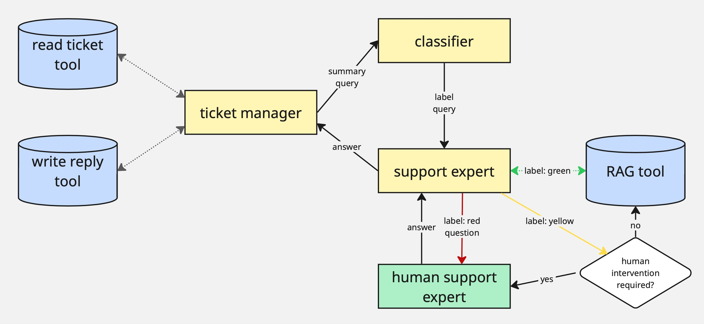

# 26.06. _Pitch_: Handling Customer Requests in a Multi-agent Environment

In the second pitch, the _contractors_ will present their solution to automated handling of customer requests. The solution will have to introduce a multi-agent environment to take off working load from an imaginary support team. The solution will have to read and categorize tickets, generate replies and (in case of need) notify the human that their interference is required. I had Claude generate me infos about any mobile app, and it came up with a mobile fitness tracking app called _FitTrack Pro_ so the thematic of the tickets will be revolving about that.

The initial idea to the architecture of this multi-agent system is the following:
* There are 3 agents:
    * The _ticket manager_ has access to a tool that reads the tickets from the pool and write the replies / closes the ticket
    * The _classifier_ classifies the ticket information into 3 importance labels: green (unimportant), yellow (intermediate), or red (urgent)
    * The _support expert_ has an access to the company internal information and can interrupt the workflow for the human input (human support expert)
* Once a new ticket / a response for an old ticket comes, the _ticket manager_ is triggered; it summarizes the infos from the ticket message history (if old) and forms a query to the _classifier_
* Once the _classifier_ receives the query, it classifies it and send further with the label to the _support expert_
* _Support expert_ has 3 options depending on the label:
    * If the label is green (unimportant), it retrieves the answer to this query itself
    * If the label is yellow (intermediate), it self-reflects if it can answer it itself (them the green scenario applies) or not (then the red scenario applies)
    * If the label is red (urgent), the _support expert_ should interrupt the workflow to receive the input from the human expert; it then formulates the question for the human and generates its output based on the human input
* Once the _support expert_ generated its response (either itself or with the human input), it sends it back to the _ticket manager_
* The customer manager then personalizes this reply (adds the customer name, makes it more polite and such) and sends it back using his reply tool.

Now once again, we will not add any actual integrations but rather simulate them, which the agent will not be aware of. All they will know is that these tools are provided and which scheme they conform to. The ticket retrieval and reply tools will be provided.

Obviously, in a real product, such automation process would run asynchronously and be triggered by the incoming message to the ticket pool. However, this functionality is not relevant for us, so we will once again simulate it and make it actually on premise . The way it will work is that we will run our system with zero input and it will simulate the trigger; then the _ticket manager_ will force call its ticket retrieval tool, where all the relevant infos will be generated (50% as a new ticket and 50% as a continuation of an existing one), which will later be used in the pipeline. The _ticket manager_ tools will implement the persistence functionality so you won't have to implement any long-term memory.

As always, you don't have to strictly follow this scheme, it is just a quick start suggestion for you, you may change it as you want.

## Task

The project folder has the following structure:
1. The [`resources` folder](https://github.com/maxschmaltz/Course-LLM-based-Assistants/tree/main/llm-based-assistants/pitches/2606/resources) contains the single file: FAQs about the _FitTrack Pro_ app generated with Claude. You will use it to make the RAG tools for the _support expert_.
2. The [`multi_agent` folder](https://github.com/maxschmaltz/Course-LLM-based-Assistants/tree/main/llm-based-assistants/pitches/2606/multi_agent) folder will store the implementation of your system.
    * [`tools.py`](https://github.com/maxschmaltz/Course-LLM-based-Assistants/tree/main/llm-based-assistants/pitches/2606/multi_agent/tools.py) will contain the tools for your agents. As mentioned, the tools for the _ticket manager_ are given to you, and you will have to make only a simple RAG tool.
    * [`prompts.py`](https://github.com/maxschmaltz/Course-LLM-based-Assistants/tree/main/llm-based-assistants/pitches/2606/multi_agent/prompts.py) will contain the prompts for your system. There is now a prompt for generation of incoming ticket messages (will simulate the real messages).
    * [`agents.py`](https://github.com/maxschmaltz/Course-LLM-based-Assistants/tree/main/llm-based-assistants/pitches/2606/multi_agent/agents.py) will implement the multi-agent system.
3. [`demo.ipynb`](https://github.com/maxschmaltz/Course-LLM-based-Assistants/tree/main/llm-based-assistants/pitches/2606/demo.ipynb) will showcase the capabilities and the limitations of the resulting system. It will take the initialized multi-agent system `multi_agent/agents.py` and run it a few times.

Your task is to fill in the code in the provided boilerplates following the instructions [below](#steps).
* You may use any LLM and any orchestration framework you like.
* You are free in your implementation as long as it follows the architectural constrains (implements a suggested or your version of a multi-agent system). 
* You don't have to strictly follow the boilerplate, it is just a quick start suggestion; if you think it fits your solution better, feel free to remove/edit the suggested functions as well as add your. The only limitation you have here is that the solution should be written as Python scripts (not a notebook!), and it should be called from `demo.ipynb`.

You don't have to find a perfect solution, imagine you are building an initial baseline; this activity is more about detecting the limitations and vulnerabilities of your own work and suggesting the ways to improve. Most importantly, you have to be able to explain your design choices and justify them for this particular use case. 

## Steps

### Setup

1. Download the [project folder](https://github.com/maxschmaltz/Course-LLM-based-Assistants/tree/main/llm-based-assistants/pitches/2606).
2. Go through the [usual setup routine](https://maxschmaltz.github.io/Course-LLM-based-Assistants/infos/llm_inference_guide/README.html) to setup your environment for the project. Put the resulting `requirements.txt` file with the dependencies in the project folder.

### RAG Tool in `multi_agent/tools.py`

1. **RAG Tool (`rag()`)**
* Write a simple RAG tool.
* You may use the most simple loading and chunking tools, the focus is not on RAG in this project; you might consider using [`langchain.tools.retriever.create_retriever_tool`](https://python.langchain.com/api_reference/core/tools/langchain_core.tools.retriever.create_retriever_tool.html). Even if the RAG quality will be bad, don't try hard to improve it.
* Return a list of retrieved `Document` objects.

### Prompts in `multi_agent/prompts.py`

Here, you will be adding the prompts you will find required for your implementation.

### Multi-agent System in `multi_agent/agents.py`

Complete the `SupportLaMA` class as follows:

1. **Initialization (`__init__()`)**
* Initialize your LLM.
* Initialize the agents.
* Replace the placeholder for the keyword arguments (`**kwargs`) with specific parameters that you need to initialize the agent (or none, if none is needed), and adjust the `init_rag_agent()` arguments accordingly.

2. **Invoke the _Ticket Manager_ (`ticket_manager_node()`)**  
* If called with a new ticket message, use the `read_last_ticket` tool to get the latest ticket and summarize the conversation to form a query for the classifier.  
* If called with an answer from the support expert, personalize the reply, use `send_reply_to_ticket` to respond, and decide whether to close the ticket.

3. **Invoke the _Classifier_ (`classify()`)**  
* Use the classifier agent to assign an importance label (`green`, `yellow`, or `red`) to the query and return it.

4. **Invoke the _Support Expert_ Agent (`support_expert_node()`)**  
* For `green`, answer using the RAG tool.  
* For `yellow`, decide if the agent can answer directly (if yes, proceed as green; if not, escalate as red).  
* For `red`, prepare a question for the human expert and handle the response accordingly.  
* Return the next step and the corresponding AI message.

5. **Define Whether to Ask Human (`human_intervention_required()`)**  
* Analyze the query content and return `True` if human input is needed, otherwise `False`.

6. **Ask Human (`ask_human_expert()`)**  
* Simulate asking the human expert for input and return their answer wrapped as an `AIMessage`.

7. **Agent Run (`run()`)**
* Route the query through the classification step and call the appropriate answering method based on the result.
* Ensure the transparent output: reasoning steps, predicted query class, decision about human intervention etc.

Additional notes:
* If you will be using `LangGraph` as the orchestration framework, create a state scheme and replace the `query`, `label` etc. parameters in the function to the `state` parameter.
* Build the routing logic in a separate function according to your framework (e.g. specify edges and nodes for `LangGraph`).
* Once again, you may add/edit anything you want as long as it creates a multi-agent system.

### Demonstration in `demo.ipynb`

Define the parameter values you need for instantiating the `SupportLaMA` class from `multi_agent/agents.py` and initialize it. Run the agent a few times -- it is supposed to always start with reading the last ticket message -- it will generate the simulated ticket infos for the pipeline.

## Deliverables & Logistics

1. Prepare slides that would present your solution to the "company board" (your fellow students). The slides should highlight the design decisions step by step (agent initialization, multi-agent pipeline etc.), explain the choices of the LLMs etc., so basically justify why you implemented the system the way you did. It should then inspect the outputs of the system in detail and provide a qualitative analysis of those. Finally, it should discuss the current limitations and possible workarounds.
2. With these slides, you will hold a presentation (30-40 min). After that, you have to be ready to answer the questions from the board.
3. Put the complete code and the slides to a GitHub repository. It may be private if you want, then you will have to send an invitation for the username `maxschmaltz`. The submission succeeds via email, and the deadline is June 26, 12pm. Note: if you will put the files to the repo manually, don't forget to exclude environment variables, dependencies etc.